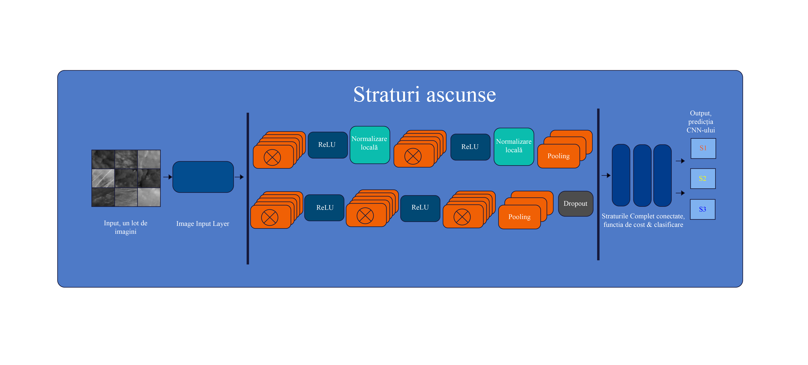

# Clasificarea Hemangioamelor Infantile Utilizand Retele Neuronale

Repo de prezentare pentru proiectul meu de diploma, sustinut in iulie 2018 la Universitatea Politehnica Bucuresti, Facultatea de Inginerie Medicala.

Lucrarea exploreaza clasificarea hemangioamelor infantile cu retele neuronale convolutionale, pornind de la imagini clinice preprocesate si evaluand arhitecturi CNN pentru clasificare binara si multi-clasa.


## Documente

- [Lucrarea de diploma](docs/licenta.pdf)
- [Prezentarea](docs/prezentare.pdf)
- [Pagina GitHub Pages](https://marsalis00123.github.io/licenta-politehnica/)

## Ce contine repo-ul

- `docs/` - PDF-ul lucrarii, prezentarea si pagina statica pentru GitHub Pages.
- `assets/` - figuri reprezentative si rezultate vizuale.
- `src/matlab/` - cod MATLAB selectat pentru antrenare, evaluare si preprocesare.
- `data/` - nota despre datele originale, care nu sunt incluse public.

## Rezultate si vizualizari




## De ce nu este inclus dataset-ul

Dataset-ul original contine imagini medicale si fisiere de lucru care nu sunt potrivite pentru publicare directa. Repo-ul pastreaza doar lucrarea, prezentarea, figurile publicabile si codul relevant. Pentru reproducere completa ar fi nevoie de un dataset public sau de permisiuni explicite pentru datele originale.

## Citare

Daca folosesti idei, figuri sau cod din acest proiect, citeaza repository-ul sau lucrarea de diploma:

```bibtex
@thesis{ignatescu2018hemangioame,
  title  = {Clasificarea Hemangioamelor Infantile Utilizand Retele Neuronale de tip Deep Neural Network},
  author = {Ignatescu, Nicolas},
  year   = {2018},
  school = {Universitatea Politehnica Bucuresti}
}
```

## Licenta

Codul sursa din `src/` este publicat sub licenta MIT. Textul lucrarii, prezentarea si imaginile sunt pastrate pentru vizualizare si portofoliu; reutilizarea lor necesita acordul autorului.
